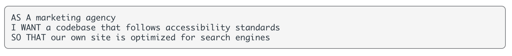
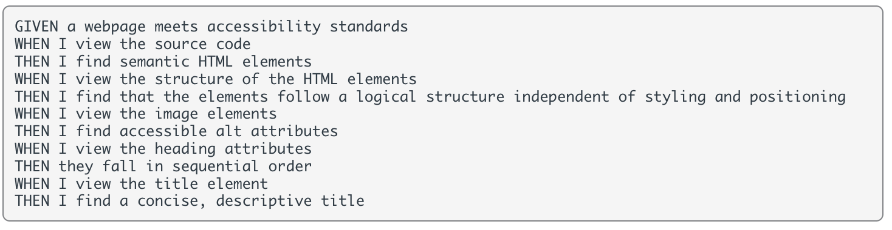

# Week One Challenge

Week One Challenge of the *UOB Full Stack Development Coding Bootcamp* requires students to refactor code to improve **accessibility**.

We were given a User Story and an Acceptance Criteria as per below:

User Story:

 

Acceptance Criteria:

 

## Changes I Implemented:

* Ensured that CSS selectors and properties were consolidated to improve readability, by grouping together classes with the same styling.

* Added comments to the HTML and CSS document to clearly distinguish different sections e.g. Body, Header, Sections, Footer. 

```
/********************************
* Content Section (Left) *
*********************************/
.content {
    /*Positioning*/
    width: 75%;
    display: inline-block;
    margin-left: 20px;
}

.search-engine-optimization,
.online-reputation-management,
.social-media-marketing {
    /*Positioning*/
    margin-bottom: 20px;
    padding: 50px;
    height: 300px;
    /*Styling*/
    font-family: 'Gill Sans', 'Gill Sans MT', Calibri, 'Trebuchet MS', sans-serif;
    background-color: #0072bb;
    color: #ffffff;
}
```